# VideoAgent — Architecture Reference

## System Overview

VideoAgent is a local Flask + React application that turns a folder of raw 4K portrait clips into a colour-graded, transition-sequenced social media reel (~30 s, 9:16). All AI inference runs locally (GPU or CPU). A Colab path exists for ProPainter when local VRAM is insufficient.

---

## AI Models at a Glance

| Model | File | Weights | Invoked by | Purpose |
|-------|------|---------|-----------|---------|
| **SigLIP** `google/siglip-base-patch16-224` | `semantic_siglip.py` | HuggingFace (auto-download) | `enrich_segments_with_siglip()` | Style-similarity embedding — cosine sim vs reference template embedding |
| **LAION Aesthetic MLP** | `semantic_siglip.py` | `style/aesthetic_mlp.pth` (auto-download ~6 MB) | `_score_aesthetic_batch()` | Aesthetic quality score 0–1 per frame |
| **CLIP ViT-L-14** (OpenCLIP, openai) | `semantic_siglip.py` | HuggingFace (auto-download) | Backbone for aesthetic MLP | 768-dim frame embedding fed into MLP |
| **Moondream2 GGUF** | `semantic_siglip.py` | Local GGUF via llama-cpp-python | `_tag_frames_moondream()` | Vision tagging (optional, `VISION_TAGGER_MODEL=moondream`) |
| **OpenCV Haar cascades** | `semantic_siglip.py`, `smart_crop.py` | Bundled with OpenCV | `_enrich_tags()`, `compute_auto_crop()` | Face/body detection for tags + crop X |
| **SAM ViT-B** | `sam_helper.py` | `style/sam_vit_b.pth` (~375 MB, auto-download) | `run_sam()` via `POST /api/sam_mask` | Click-to-segment subject mask for split-grade compositing |
| **Qwen2.5-7B-Instruct** | `llm_planner.py` | LM Studio, `localhost:1234` | `plan_with_llm()` (optional) | Narrative reorder — advisory only, caps at ≥80% of heuristic count |
| **PySceneDetect ContentDetector** | `analyze_and_edit.py` | None | `_detect_scenes()` | Scene cut detection, threshold=20 |
| **OpenCV optical flow** (Farneback) | `semantic_siglip.py` | None | `_estimate_motion_smoothness()` | Motion smoothness score (skipped for segments < 3 s) |
| **ProPainter** | `inpaint_worker.py` | `ProPainter/weights/` | `run_inpaint_job()` / `run_remote_inpaint_job()` | Video inpainting / object removal |

---

## Data Flow Diagram

```mermaid
flowchart TD
    subgraph Browser["Browser UI (React)"]
        UI_Sidebar["PipelineSidebar\ntemplate · quality · LLM toggle"]
        UI_Review["Review Tab\naccept/reject · trim · grade · crop · SAM"]
        UI_Inpaint["Inpaint Tab\ndraw mask · progress poll"]
        UI_Output["Output Tab\nvideo preview · download"]
    end

    subgraph Flask["Flask  app.py  :5100"]
        direction TB
        API_Run["POST /api/run"]
        API_Review["POST /api/review"]
        API_Stream["GET /api/stream  (SSE)"]
        API_Status["GET /api/status"]
        API_SAM["POST /api/sam_mask"]
        API_Crop["POST /api/crop_auto"]
        API_Inpaint["POST /api/inpaint/start"]
        API_InpStatus["GET /api/inpaint/status/:id"]
        API_Video["GET /video/:path  (HTTP 206)"]
        State["_pipeline_state\nphase · segments · log_lines\nrunning · ffmpeg_progress"]
        SSE_Queues["Per-client SSE queues\n(fan-out _emit)"]
    end

    subgraph AnalysisPipeline["analyze_and_edit.py  ––ui-mode  (subprocess)"]
        direction TB
        SceneDetect["PySceneDetect ContentDetector\nthreshold=20\n→ scene boundaries per clip"]
        AudioAnalysis["librosa audio energy\n→ base score per segment"]
        Enrich["enrich_segments_with_siglip()"]
        subgraph EnrichModels["semantic_siglip.py"]
            SigLIP["SigLIP ViT-B/16\ngoogle/siglip-base-patch16-224\n→ 768-dim embedding\n→ cosine sim vs template"]
            AestheticMLP["CLIP ViT-L-14 + LAION MLP\n→ aesthetic score 0–1"]
            Moondream["Moondream2 GGUF  optional\nVISION_TAGGER_MODEL=moondream\n→ frame description → tags"]
            HaarTags["OpenCV Haar + HSV heuristics\n→ tags: bright/dark/outdoor/indoor\n   warm/cool/face/busy/minimal"]
            OptFlow["Farneback optical flow\nskipped for segments < 3 s\n→ motion_smoothness"]
        end
        EditBrain["editing_brain.plan_edit()\n3-pass heuristic selection\n  1. Opener pass\n  2. Middle pass (dedup + lighting penalty)\n  3. Closer pass"]
        LLMPlanner["llm_planner  optional\nQwen2.5-7B via LM Studio :1234\n→ advisory narrative reorder\n→ cannot reduce count below 80%"]
        TransitionAssign["transitions.pick_transition()\ncontent-delta rules\n→ 14 transition types"]
        SegmentJSON["stdout: <<SEGMENTS_JSON_START>>\n[segment array]\n<<SEGMENTS_JSON_END>>"]
    end

    subgraph RenderPipeline["analyze_and_edit.py  ––render-only  (subprocess)"]
        direction TB
        Pass1["Pass 1 — ffmpeg encode each segment\ngrade filters · LUT · crop\nSAM split-grade (if mask enabled)"]
        Pass2["Pass 2 — xfade transitions\nPhase 2: dissolve · fade_black · wipe_up\n         wipe_left · zoom_in · zoom_out\n         push_up · slide_left"]
        Pass3["Pass 3 — concat\nPhase 1 inserts between clips:\ncut · jump_cut · flash_white · flash_black\ndip_black · dip_white"]
        OutputFile["stdout: <<OUTPUT_PATH>>/path/reel.mp4"]
    end

    subgraph StyleProfiles["style_profiles/*.json"]
        SP["5 templates\ntravel_reel · event_concert · grwm_style\nproduct_style · breakfast_food\n\nEach contains:\n· siglip_style_embedding 768-dim\n· scoring_weights\n· duration_preferences\n· tag_bias · pacing · blur_threshold"]
    end

    subgraph OnDemand["On-demand endpoints"]
        SAM_Helper["sam_helper.run_sam()\nSAM ViT-B  style/sam_vit_b.pth\n~375 MB auto-download\n~5 s GPU · ~50 s CPU\n→ mask_b64 PNG"]
        SmartCrop["smart_crop.compute_auto_crop()\nOpenCV Haar face+body cascade\n→ crop x offset for 9:16"]
        subgraph Inpainting["ProPainter inpainting"]
            InpLocal["Local  run_inpaint_job()\nProPainter subprocess\nMAX_SHORT_SIDE=400px cap\n~20-30 min / 3 s on CPU\n→ output/inpainted/<job_id>.mp4"]
            InpRemote["Remote  run_remote_inpaint_job()\n→ Drive sync folder\n→ Colab T4 picks up job\n→ result syncs back via Drive"]
        end
    end

    subgraph Storage["Disk"]
        RawClips["raw_clips/*.mp4\nsource footage"]
        StyleDir["style/\n  aesthetic_mlp.pth\n  sam_vit_b.pth"]
        OutputDir["output/\n  reel.mp4\n  _pending_segments.json\n  inpaint_jobs/<id>.json\n  inpainted/<id>.mp4"]
        LogsDir["logs/\n  run_summary_*.txt\n  segment_scores_*.csv"]
    end

    subgraph Colab["Google Colab  (optional)"]
        ColabNB["propainter_worker.ipynb\nheartbeat.json every 60 s\njob polling: pending → processing → done"]
    end

    %% User actions
    UI_Sidebar -->|"POST /api/run\ntemplate · quality · LLM flag"| API_Run
    UI_Review -->|"POST /api/review\nsegments + overrides"| API_Review
    UI_Inpaint -->|"POST /api/inpaint/start\nsegment_index · video_path · mask_b64 · mode"| API_Inpaint
    UI_Inpaint -->|"GET /api/inpaint/status/:id\npoll every 2 s"| API_InpStatus
    UI_Review -->|"POST /api/sam_mask\nvideo_path · timestamp · point_x · point_y"| API_SAM
    UI_Review -->|"POST /api/crop_auto\nvideo_path · start · end"| API_Crop
    UI_Output -->|"GET /video/:path  206 range"| API_Video

    %% SSE
    API_Stream -->|"replay + live fan-out"| SSE_Queues
    Browser -->|"EventSource /api/stream"| API_Stream

    %% Flask → subprocess (analysis)
    API_Run -->|"subprocess Popen\nenv: STYLE_TEMPLATE · RENDER_QUALITY\nENABLE_LLM_PLANNER · VISION_TAGGER_MODEL"| AnalysisPipeline
    AnalysisPipeline -->|"stdout sentinel JSON"| SegmentJSON
    SegmentJSON -->|"parse → _pipeline_state.selected_segments\nphase = reviewing"| State

    %% Flask → subprocess (render)
    API_Review -->|"writes _pending_segments.json\nsubprocess Popen --render-only"| RenderPipeline
    RenderPipeline -->|"<<OUTPUT_PATH>>"| OutputFile
    OutputFile -->|"_pipeline_state.last_output\nphase = done"| State

    %% Progress streaming
    State -->|"_emit() per stdout line"| SSE_Queues

    %% Analysis internals
    RawClips --> SceneDetect
    RawClips --> AudioAnalysis
    SceneDetect --> Enrich
    AudioAnalysis --> Enrich
    SP -->|"template embedding\n+ scoring weights"| SigLIP
    Enrich --> SigLIP
    Enrich --> AestheticMLP
    Enrich --> HaarTags
    Enrich -->|"if VISION_TAGGER_MODEL=moondream"| Moondream
    Enrich -->|"if duration >= 3 s"| OptFlow
    SigLIP --> EditBrain
    AestheticMLP --> EditBrain
    HaarTags --> EditBrain
    Moondream --> EditBrain
    OptFlow --> EditBrain
    EditBrain -->|"if LLM enabled"| LLMPlanner
    LLMPlanner --> TransitionAssign
    EditBrain --> TransitionAssign
    TransitionAssign --> SegmentJSON

    %% Render internals
    OutputDir --> Pass1
    Pass1 --> Pass2
    Pass2 --> Pass3
    Pass3 --> OutputDir

    %% On-demand
    API_SAM --> SAM_Helper
    SAM_Helper --> StyleDir
    API_Crop --> SmartCrop
    API_Inpaint -->|"mode=local"| InpLocal
    API_Inpaint -->|"mode=remote"| InpRemote
    InpRemote -->|"Drive for Desktop sync"| Colab
    Colab -->|"result syncs back"| InpRemote
    InpLocal --> OutputDir
    InpRemote --> OutputDir

    %% Storage links
    RawClips --> RenderPipeline
    StyleDir --> SAM_Helper
    StyleDir --> AestheticMLP
```

---

## Bottlenecks

| Stage | Typical time | Notes |
|-------|-------------|-------|
| SigLIP + CLIP ViT-L-14 load | ~30 s first run | Cached in module globals — subsequent calls instant |
| Moondream tagging (if enabled) | ~5–30 s per segment | Disabled by default; use `VISION_TAGGER_MODEL=moondream` |
| Motion smoothness (optical flow) | ~31 s per segment | **Skipped for segments < 3 s** — saved ~1640 s for travel_reel template |
| SAM ViT-B mask | ~50 s CPU, ~5 s GPU | Synchronous — blocks `/api/sam_mask` response |
| ProPainter inpaint (local CPU) | ~20–30 min per 3 s | OOM risk on Quadro M1200 (4 GB VRAM); use Colab for reliable runs |
| ProPainter inpaint (Colab T4) | ~3–5 min per 3 s | Limited by Drive sync latency on both ends |

---

## Hardcoded Values and Fragile Areas

### Hardcoded constants (not env-overridable)
| Location | Value | Risk |
|----------|-------|------|
| `analyze_and_edit.py` | `ContentDetector(threshold=20)` | Can't tune without code change — too-low threshold over-segments, too-high misses cuts |
| `sam_helper.py` | `SAM_CHECKPOINT = style/sam_vit_b.pth` | Path relative to project root — breaks if run from a different cwd |
| `sam_helper.py` | Largest-mask selection (`argmax sum`) | Always picks biggest mask region; may select background over small subject |
| `semantic_siglip.py` | `_SIGLIP_MODEL_NAME = "google/siglip-base-patch16-224"` | No env override — swapping to ViT-L requires code change |
| `inpaint_worker.py:147,290` | `MAX_SHORT_SIDE = 400` | Caps ProPainter resolution; duplication in two functions |

### Env-overridable but with bad defaults on Windows
| Env var | Default | Issue |
|---------|---------|-------|
| `PROPAINTER_DIR` | `/workspace/ProPainter` | Linux path — always wrong on Windows; must be set explicitly |
| `DRIVE_SYNC_DIR` | `output/inpainted` | Fine locally but Drive for Desktop may mount at a different path |

### Fragile patterns
1. **Stdout sentinel protocol** — `analyze_and_edit.py` and `app.py` communicate via `<<SEGMENTS_JSON_START>>` / `<<SEGMENTS_JSON_END>>` / `<<OUTPUT_PATH>>` markers in subprocess stdout. Any upstream library that prints one of those exact strings would corrupt parsing silently.

2. **SAM module-level cache is not thread-safe** — `_predictor` in `sam_helper.py` is a module-level global. Concurrent `POST /api/sam_mask` requests from two browser tabs would race on `set_image()`.

3. **ProPainter output path discovery** — `inpaint_worker.py` expects `output_dir/<stem>/inpaint_out.mp4`. Falls back to `rglob("inpaint_out.mp4")` but this is fragile if ProPainter changes its internal output structure.

4. **LM Studio model filter** — `_NON_TEXT_PATTERNS = ("moondream", "embed", "nomic", "mmproj", "whisper", "clip")` in `llm_planner.py`. A newly loaded model with none of these substrings in its name would be picked even if it's not a text generation model.

5. **Phase transition on subprocess teardown** — After the segment JSON sentinel is printed, `app.py` immediately sets `phase = "reviewing"` and `running = False`. The subprocess continues running (PyTorch teardown). A second `/api/run` during this window could start a second pipeline. Documented but not fully guarded.

6. **Two venvs** — `.venv` (active) and `venv` (legacy Python 3.10). Scripts activated from the wrong venv silently use stale package versions.

7. **`New folder/`** — 50+ clips that are not in `raw_clips/` and are not picked up by the pipeline.

---

## Environment Variables

| Variable | Default | Effect |
|----------|---------|--------|
| `STYLE_TEMPLATE` | `travel_reel` | Which `style_profiles/*.json` to load |
| `RENDER_QUALITY` | `proxy` | ffmpeg encode quality preset |
| `ENABLE_LLM_PLANNER` | `0` | Enable Qwen2.5 LLM reorder step |
| `VISION_TAGGER_MODEL` | *(empty)* | Set to `moondream` to enable Moondream frame tagging |
| `VISION_TAGGER_MAX_SEGMENTS` | *(all)* | Cap segments sent to Moondream |
| `DISABLE_CACHE` | `0` | Bypass analysis cache in `analysis/cache.json` |
| `SIGLIP_BATCH_SIZE` | `16` | SigLIP GPU batch size |
| `MOTION_SMOOTHNESS_MIN_DURATION` | `3.0` | Seconds below which optical flow is skipped |
| `SAM_DEVICE` | *(auto)* | `cuda` or `cpu` for SAM ViT-B |
| `PROPAINTER_DIR` | `/workspace/ProPainter` | Path to ProPainter install |
| `DRIVE_SYNC_DIR` | `output/inpainted` | Google Drive sync root for remote inpaint jobs |
| `LLM_PLANNER_MODEL` | *(auto-discover)* | Force a specific LM Studio model ID |
| `VIDEO_AGENT_PORT` | `5100` | Flask listen port |
| `ENABLE_SPEECH_ANALYSIS` | `0` | Enable Whisper speech activity scoring |
